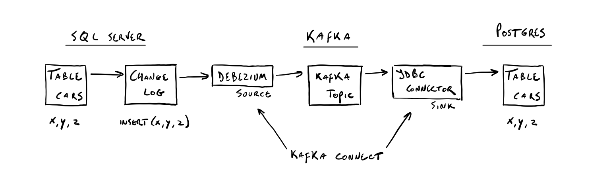

Change data capture (CDC) has been around for at least a decade if not longer. I've tried finding the first vendor to add it to their database but have only stumbled upon [articles](https://www.red-gate.com/simple-talk/sql/learn-sql-server/introduction-to-change-data-capture-cdc-in-sql-server-2008/) of 2008 or 2009 pointing to SQL Server 2008 where it was seen as more of an auditing solution rather than a way to integrate and react to changes on data.

If you're already familiar with CDC I suggest skipping to the Kafka setup.

## What is CDC?

CDC is one of two techniques which stem from replication, the other technique is called change tracking. CDC logs all changes to data and data structures so they can be re-used in different systems, where change tracking only captures net changes to a table. CDC is now often combined with streaming platforms such as Apache Kafka or Qlik Replicate so that changes can be replicated per change rather than in bulk. These applications have direct integration with other tools and databases while also offering low latency and high throughput of events. In this post I'll be looking at log-based CDC but there are other implementation methods, [this wiki page](https://en.wikipedia.org/wiki/Change_data_capture#Methodology) does a good job of explaining the others. Log-based means the database manages a change log for all changes.

## CDC advantages

So that sounds good, but why should you use it?

- Faster integration of data and changes, which enables faster and more accurate decision making
- When combined with streaming it removes load-heavy processes from your production environment
- Logging your change history enables you to restore to any point in time

Let's now dive into setting up change data capture for SQL Server to PostgreSQL using Apache Kafka on Ubuntu 18.04.

## Setting up Apache Kafka

*Before installing make sure the system is updated and Java 8 (or higher) is installed.*

### Create a user named kafka and switch to it

```bash
$ sudo adduser kafka
$ su - kafka
```

### Download Kafka

```bash
$ wget https://apache.belnet.be/kafka/2.6.0/kafka_2.13-2.6.0.tgz
```

See the Kafka [downloads page](https://kafka.apache.org/downloads) for the latest releases.

### Extract the archive

```bash
$ tar -xvzf kafka_2.13-2.6.0.tgz
```

### Create a soft link (optional)

```bash
$ ln -s kafka_2.13-2.6.0 kafka
```

Adding a symbolic link ensures easily switching between versions in the future.

### Edit server.properties

```bash
$ vi ~/kafka/config/server.properties
```

Add or edit the following properties:


```bash
listeners=PLAINTEXT://0.0.0.0:9092
...
advertised.listeners=PLAINTEXT://localhost:9092
...
delete.topic.enable=true
```

Now switch to the Kafka directory.

### Start Zookeeper and Kafka
```bash
$ bin/zookeeper-server-start.sh config/zookeeper.properties
$ bin/kafka-server-start.sh config/server.properties
```

### Test the installation

```bash
$ bin/kafka-topics.sh --create --zookeeper localhost:2181 --replication-factor 1 --partitions 1 --topic myTopic
```

This command creates a topic.

```bash
$ echo "Hello there!" | /bin/kafka-console-producer.sh --broker-list localhost:9092 --topic myTopic > /dev/null
```

This command publishes the message “Hello there!“ to the myTopic topic.

```bash
$ ~/kafka/bin/kafka-console-consumer.sh --bootstrap-server localhost:9092 --topic myTopic --from-beginning
```

This command consumes the myTopic topic from the beginning of the queue.

### Install the Kafka Connect plugins

```bash
$ mkdir ~/kafka/connect
```

Download the [Debezium plugin](https://debezium.io/releases/) for SQL Server and the [JDBC Connector](https://docs.confluent.io/3.2.0/connect/connect-jdbc/docs/sink_connector.html), place them in the directory created above.

You should also download the [PostgreSQL JDBC driver](https://jdbc.postgresql.org/download.html) and place it in the lib directory.

```bash
$ vi ~/kafka/config/connect-distributed.properties
```
Add or edit the following properties:

```bash
...
plugin.path=/home/kafka/kafka/connect
```

### Start Kafka Connect

Kafka Connect is a service to define connectors which make direct integration possible with other data systems.

* A source connector gathers data such as logs, change data capture or any other flow of information.
* A sink connector delivers data from Kafka into other systems.

```bash
$ bin/connect-distributed.sh config/connect-distributed.properties
```

This command will start Kafka Connect in distributed mode [which is recommended](https://docs.confluent.io/current/connect/userguide.html).

## Streaming CDC



CDC can be set at a table level in SQL Server, for this example the following table is used in database testDB.

```sql
CREATE TABLE dbo.cars (
  car_id INT PRIMARY KEY,
  car_make VARCHAR(50) NOT NULL,
  car_type VARCHAR(50),
  car_fuel VARCHAR(20)
  year INT
);

insert into dbo.cars values (1, 'Mercedes', 'C Coupe', 'Diesel', 2004);
insert into dbo.cars values (2, 'Audi', 'A5', 'Diesel', 2018);
insert into dbo.cars values (3, 'BMW', '4', 'Hybrid', 2010);
insert into dbo.cars values (4, 'Alfa Romeo', 'Giulia', 'Petrol', 2020);
```

To enable CDC for this table the following statement is passed.

```sql
EXEC sys.sp_cdc_enable_table
@source_schema = N'dbo',
@source_name = N'cars',
@role_name = N'admin',
@supports_net_changes = 1
```

In the Kafka directory create the following two files:

**source.json**

```bash
{
  "name": "sqlserver-connect",
  "config": {
  "connector.class": "io.debezium.connector.sqlserver.SqlServerConnector",
  "database.hostname": "localhost",
  "database.port": "1433",
  "database.user": "SA",
  "database.password": "P@ssword",
  "database.dbname": "testDB",
  "database.server.name": "cars",
  "table.whitelist": "dbo.cars",
  "database.history.kafka.bootstrap.servers": "localhost:9092",
  "database.history.kafka.topic": "dbhistory.cars"
  }
}
```

**sink.json**

```bash
{
    "name": "jdbc-sink",
    "config": {
        "connector.class": "io.confluent.connect.jdbc.JdbcSinkConnector",
        "tasks.max": "1",
        "topics": "cars.dbo.cars",
        "table.name.format": "cars",
        "connection.url": "jdbc:postgresql://localhost:5432/testdb?user=postgres&password=postgres",
        "transforms": "unwrap",
        "transforms.unwrap.type": "io.debezium.transforms.ExtractNewRecordState",
        "transforms.unwrap.drop.tombstones": "false",
        "auto.create": "true",
        "insert.mode": "upsert",
        "pk.fields": "car_id",
        "pk.mode": "record_key",
        "delete.enabled": "true"
    }
}
```

*Auto-evolution of schema changes can be set using the auto.evolve setting.*

Kafka Connect is exposed over a REST API, this means connector management can be done using requests.

### Enable the SQL Server connector

```bash
$ curl -i -X POST -H "Accept:application/json" -H "Content-Type:application/json" localhost:8083/connectors/ -d @source.json
```

### Enable the JDBC sink connector

```bash
$ curl -i -X POST -H "Accept:application/json" -H "Content-Type:application/json" localhost:8083/connectors/ -d @sink.json
```

### Test the setup

In SQL Server execute the following statements:

```sql
insert into dbo.cars values (5, 'Porsche', '911', Petrol, 2000);
insert into dbo.cars values (6, 'BMW', '5', 'Diesel', 2013);
insert into dbo.cars values (7, 'Volvo', 'V60', Diesel, 2016);
insert into dbo.cars values (8, 'BMW', '4', 'Diesel', 2020);
update dbo.cars set year = 2010 where car_id = 1;
update dbo.cars set year = 2019 where car_id = 2;
```

Now check for changes in PostgreSQL.

```bash
 car_id |  car_make  | car_type | car_fuel | year
--------+------------+----------+----------+------
      1 | Mercedes   | C Coupe  | Diesel   | 2010
      2 | Audi       | A5       | Diesel   | 2019
      3 | BMW        | 4        | Hybrid   | 2010
      4 | Alfa Romeo | Giulia   | Petrol   | 2020
      5 | Porsche    | 911      | Petrol   | 2000
      6 | BMW        | 5        | Diesel   | 2013
      7 | Volvo      | V60      | Diesel   | 2016
      8 | BMW        | 4        | Diesel   | 2020
```

Changes committed to SQL Server should now be replicated to PostgreSQL.

