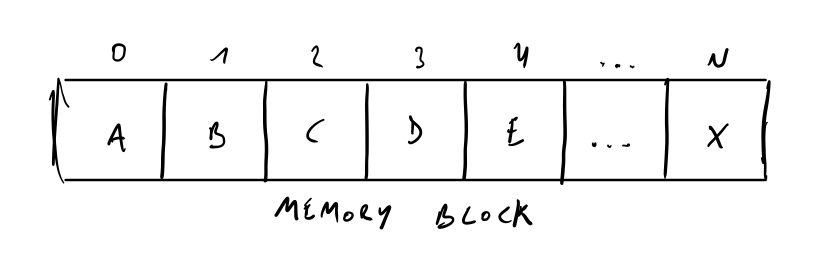
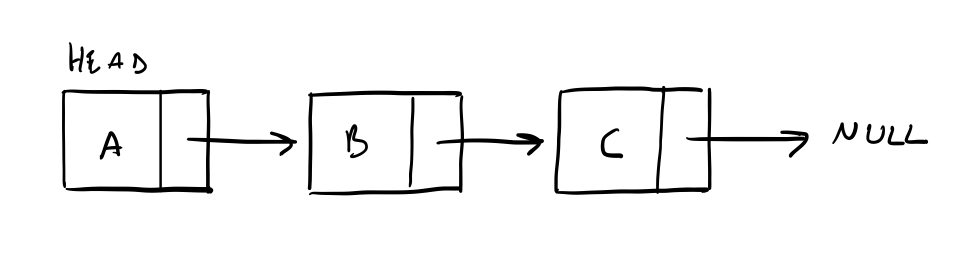
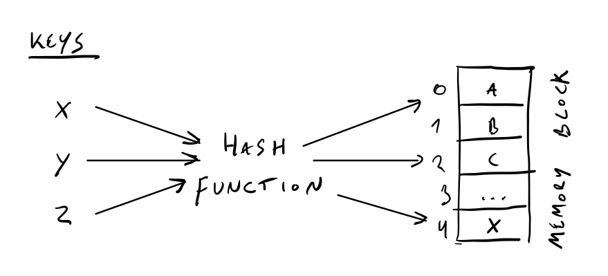
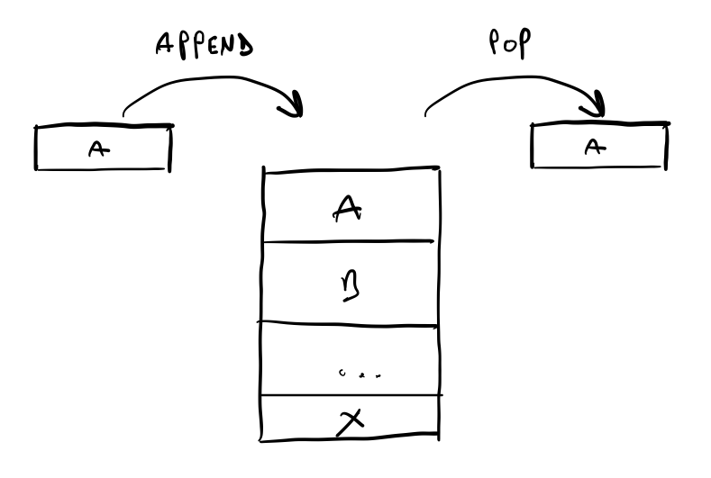
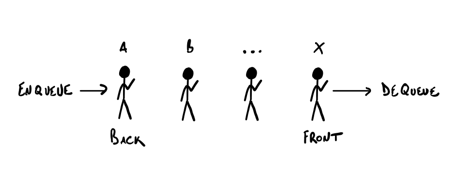
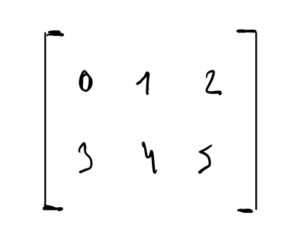
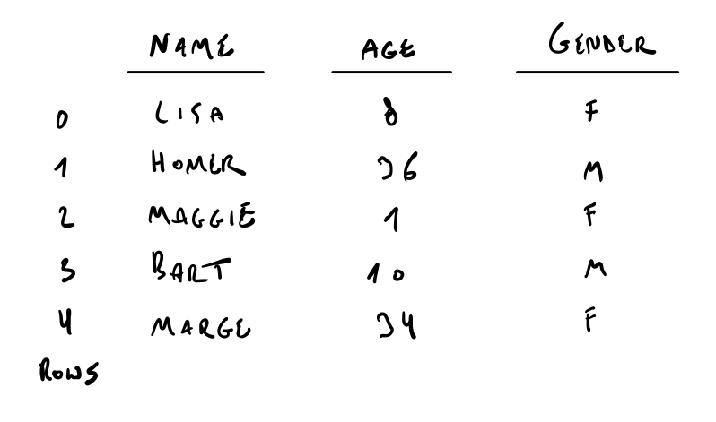
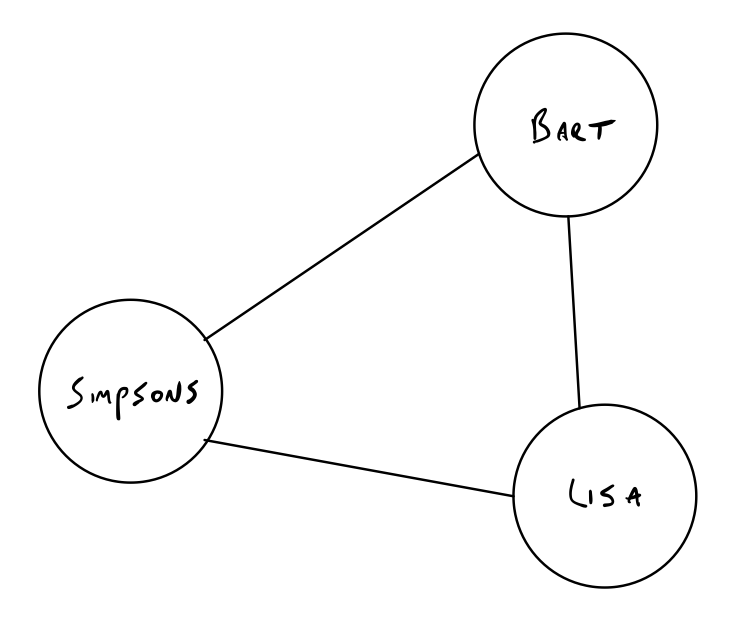
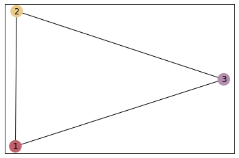
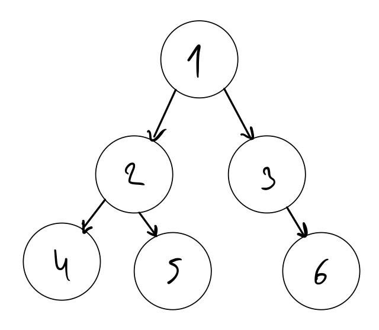

Last week someone asked me if I could explain the difference between a list and an array. *“Aren't they the same thing in Python?“* It rang a bell but I couldn't immediately formulate an answer which resulted in me googling the answer. I admit I haven't had to use or think about data structures in a while, so why not write up a refresher with some Python examples?

## What are data structures?

Data structures refer to the way data is organized in a computer so that it can be used effectively. The specification of data and the operations on that data without the implementation in a certain language is called an abstract data structure or ADT. Choosing the right data structure enables a system to perform a task more efficiently. I'll be looking at the most important ADT's, their implementation in Python and the differences between them. I won't include manipulations on them as that can get very broad (think reversing linked lists).

## Storing in memory

When a variable x is created memory has to be allocated to hold it. Most programming languages have some form of memory management where memory is dynamically allocated and freed when no longer required, however there are exceptions such as Rust and C++ where the developer has to take care of this management. In Python memory is managed by the private [heap](https://en.wikipedia.org/wiki/Memory_management#HEAP) space where all objects and data structures are located in a private heap which is a pool of memory (not to be confused with the [heap](https://en.wikipedia.org/wiki/Heap_(data_structure)) data structure). Heap space is allocated by Python's memory manager and recycled by a garbage collector which returns it to the heap space. 

But how does a program allocate memory and resources on a shared system? Python solves this with the Global Interpreter Lock or GIL which I'll get into in a future post dealing with threading.


## Measuring complexity and speed

Efficiently storing data goes hand in hand with the operations on said data. These operations come in the form of algorithms which are ADT specific. The complexity of these algorithms can be measured to see how much time and space a task will take as data increases and as such influence which ADT should be used. 

- If data doubles and time does as well; this is called linear complexity
- If data doubles and time increases by four; this is called quadratic complexity

These complexities are represented by the big O notation. In general we want to use algorithms with a complexity less than quadratic. An overview of these operations and their complexity can be found [here](https://www.bigocheatsheet.com/) as a cheat sheet.

A nice gotcha here is that these representations are purely theoretical and only show algorithm performance rather can the actual seconds of time.

## Arrays and lists

### Arrays

An array stores data as a single block of items in memory with each item accessible by its index. 



Lists can be used as arrays in Python as the language does not support arrays out of the box. To define a list we can use square brackets.

```python
simpsons = ["Homer", "Marge", "Bart", "Lisa", "Maggie"]
```

Check [this link](https://docs.python.org/3.8/tutorial/datastructures.html#more-on-lists) for Python's list documentation.

Using lists for mathematical operations also works of course but is rather slow, this is why [Numpy](https://numpy.org/doc/stable/contents.html)'s N-dimensional array object or ndarray is commonly used when true arrays are required.

```python
%time for i in range(10): [x * 2 for x in list(range(1000000))]
```

`CPU times: user 672 ms, sys: 469 ms, total: 1.14 s` \
`Wall time: 1.14 s`

```python
import numpy as np

%time for i in range(10): np.arange(1000000) * 2
```

`CPU times: user 31.2 ms, sys: 15.6 ms, total: 46.9 ms` \
`Wall time: 18.8 ms`

This happens because of the following reasons:

- Numpy arrays are stored as a single block of memory with items of the same data type (which enables fast lookups) and consume less memory compared to lists
- Numpy can break down operations and process them side by side
- Numpy integrates lower level code which has very low execution time

Python does contain [the array module](https://docs.python.org/3.10/library/array.html) which can be used to define arrays. This module is a thin wrapper around C arrays and is a lot more lightweight than Numpy but I've honestly never really used it.


### Lists

When talking about lists here I'm referring to singly linked lists. The elements of a linked list are stored at separate locations in memory and are linked by pointers. Linked lists can be used to implement stacks, queues and graphs which we'll get to in a bit.



Just like the array ADT, linked lists are not part of Python's standard types. Because of this we have to write our own implementation.


```python
class Node:
    def __init__(self, val, next):
        self.val = val
        self.next = next
        
n3 = Node(3, None)
n2 = Node(2, n3)
n1 = Node(1, n2)

traverse = lambda x: [x.val] + traverse(x.next) if x else []

print(traverse(n1))
```

`[1, 2, 3]`

Linked lists can be used to save memory as only the needed space is used. They can be used when memory usage, item insertion or delete time is important. They can also be extended as circular linked lists where all nodes are connected in a circle and doubly linked lists where each node points to the next **and** previous node.

## Hash tables

Hash tables are comparable to arrays as they also store data in a single block of memory. In essence they are an extension of arrays and differ in that their keys are flexible where array keys are sequential integers (0 -> N). These flexible keys are generated through a hashing function with data stored as key-value pairs.



Hash tables are implemented as Dictionary types in Python, which is a frequently underused but very important type. It offers fast searching with the key values themselves representing the index of the array which stores the data. They require a hashable key and the order of elements to not be fixed.

```python
simpsons = {'Family': 'Simpsons', 'Size': 5, 'Town': 'Springfield'}
```

On average unsorted arrays will have to search half their values, hashes generate their keys which results in a constant search time no matter the size of the data.

## Stacks and queues

### Stacks

A stack stores items next to each other in memory in a last-in/first-out (LIFO) manner. Elements are only added or removed from the end of the stack.



Python offers multiple ways to implement stacks such as lists and doubly linked lists called deque (pronounced deck).

**lists**

```python
dishes = []

dishes.append('spoon')
dishes.append('plate')
dishes.append('pot')

dishes.pop()
```

`'pot'`

When the block of memory storing the list is full Python has to allocate a new block which may result in append operations taking longer than normal. This is where deque comes in.

**collections.deque**

```python
from collections import deque
dishes = deque()

dishes.append('fork')
dishes.append('plate')
dishes.append('wine glass')

dishes.pop()
```

`'wine glass'`

The syntax looks identical but because deque is implemented as a doubly linked list each entry is stored in its own memory block.

### Queues

Queues are pretty much the same as stacks with the difference being items are ordered in a first-in/first-out manner (FIFO). Elements are added at the end and removed at the front of the queue.



Lists and deque can also be used to implement queues.

**lists**

```python
customers = []

customers.append('Homer')
customers.append('Lenny')
customers.append('Carl')

customers.pop(0)
```
`'Homer'`

**deque**

```python
customers = deque()

customers.append('Barney')
customers.append('Moe')
customers.append('Krusty')

customers.popleft()
```

`'Krusty'`


Stacks and queues are used when data has to be managed in a LIFO or FIFO manner compared to other ADT's where access is random.

## Matrices and data frames

Matrices and data frames are two dimensional structures or tables arranged in rows and columns. Rather than being implemented from an ADT they are more implementation based.

### Matrices

A matrix is a numeric mathematical data structure which is often used in computer graphics or machine learning.



Matrices in Python can be represented as a list of lists using lists or Numpy's ndarray type.

**Nested list**

A simple way to create a list of lists is the following.

```python
A = [[1, 2], 
     [3, 4],

B = [[1, 2], 
     [3, 4],

for i in range(len(A)):
   for j in range(len(B[0])):
       print(X[i][j] + Y[i][j])
```

This could also be implemented as a nested list comprehension but is quite cumbersome, Numpy to the rescue!

**Nested ndarray**

Numpy can return a matrix from an array object or a string.

```python
import numpy as np

M = np.matrix('1 2; 3 4')
```

This implementation is far easier to write and read while also offering Numpy's matrix operations such as multiply and dot.


### Data frames

Data frames have labeled axes (rows and columns) and can be thought of as a dict-like container for objects.



Data frames are the primary data structure of the [pandas](https://pandas.pydata.org/docs/) library which is used for analytical purposes in Python.

```python
import numpy as np
import pandas as pd

M = np.array([[1, 2], [3, 4]])

df = pd.DataFrame(data=M, index=["1", "2"], 
     columns=["A", "B"])
```

The pandas library is built ontop of Numpy and thus also profits from its many optimizations. In addition it also comes with a lot of optimized operations on the data frame such as pivot, unique and isnull. These functions are preferable rather than writing your own transformations and calling apply (especially when dealing with larger volumes of data).

```python
df = pd.DataFrame(np.random.choice([1,2,3,4,5], size=(10000,5)))
%time df.mul(2)
```

`CPU times: user 554 µs, sys: 163 µs, total: 717 µs` \
`Wall time: 434 µs`

```python
%time df.apply(lambda row: row * 2, axis=1)
```

`CPU times: user 2.03 s, sys: 20.2 ms, total: 2.05 s` \
`Wall time: 2.07 s`

## Graphs

Graphs are a data structure which implement the concepts of undirected and directed graphs from [graph theory](https://en.wikipedia.org/wiki/Graph_theory). They are represented as vertices (or nodes) and edges (or links) with direct graph edges having arrows. 



We could write a graph implementation from scratch but we'd miss out on algorithms such as shortest path. Good Python libraries implementing the graph data structure are [NetworkX](https://networkx.org/) and [igraph](https://igraph.org/).

```python
import networkx as nx

G = nx.Graph()


G.add_nodes_from([(1),(2),(3)])

G.add_edges_from([(1, 2),
                  (2, 3),
                  (3, 1)])

nx.draw_networkx(G, node_color=['#bf616a',
                                '#ebcb8b',
                                '#b48ead'])
```



The graph data structure is ideal for representing networks and other non-linear structures.


## Trees

A tree has a hierarchical structure and consists of root, parent and child nodes. Trees offer fast data retrieval and when paired with certain properties offer loads of optimization. Examples of these types of trees are the [AVL-tree](https://en.wikipedia.org/wiki/AVL_tree), [Red-black tree](https://en.wikipedia.org/wiki/Red%E2%80%93black_tree) and [B-tree](https://en.wikipedia.org/wiki/B-tree). For instance Postgres uses a B-tree as one of its index types.



An example of a binary tree (where only two children are allowed per parent) is given below with the binarytree library.

```python
from binarytree import Node

root = Node(1)
root.left = Node(2)
root.right = Node(3)
root.left.right = Node(4)
```

## Summary

Thinking about data structures and knowing what's what isn't unimportant as they are at the very core of algorithms. Checking complexity and which structure should be used when could result in a dramatic increase in operation speed. This post was a lot of fun to write as I'm brushing up on my software engineer skills. Of course this is more of a summary with some Python examples. An example of a good global reference, albeit focused on C++, is [Data Abstraction & Problem Solving with C++](https://www.goodreads.com/book/show/14795909-data-abstraction-problem-solving-with-c?from_search=true&from_srp=true&qid=joRbsUnjBv&rank=3).